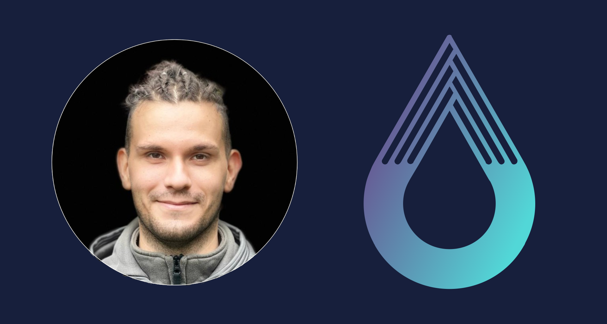
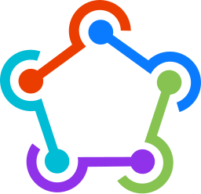

<h1>Cristian Boarna</h1>
<h3>Fullstack Developer</h3>

## About me
I am a seasoned technology professional with a rich background in software development, cloud computing, and data engineering in the "fintech", "medtech", "traveltech" and "energytech" domains. My expertise spans across various domains including TypeScript, Golang, AWS, Docker, and Kubernetes, among others. My experience in leading teams and managing complex projects, combined with my deep technical knowledge, positions me as a valuable asset in any technology-driven organization.

In addition to my technical skills, I am also a proactive problem-solver who thrives in challenging environments. I am a self-starter that has brought to resolution complex problems with only a high level steer needed. I have quickly adapted to new technologies and frameworks, and am committed to continuous learning and improvement. I possess strong communication skills and a collaborative approach that make me an effective team player and leader.

You can find my CV [here](https://cv.crisboarna.com/). 

A blog post on how I built my CV can be found [here](https://blog.engineermindscape.com/p/building-and-deploying-a-react-cv).

## Some of my work
### Browser Extensions
#### Focusly

### Packages
####  NPM
- [aws-cdk-lib-util](https://www.npmjs.com/package/aws-cdk-lib-util)
- [react-skillbars](https://www.npmjs.com/package/react-skillbars)
- [react-scroll-element](https://www.npmjs.com/package/react-scroll-element)
- [fb-messenger-bot-api](https://www.npmjs.com/package/fb-messenger-bot-api)
- [cdk-aurora-globaldatabase](https://www.npmjs.com/package/cdk-aurora-globaldatabase) (contributor)
### Plugins
####  Fastlane
- [fastlane-plugin-firebase_test_lab_integration ](https://github.com/crisboarna/fastlane-plugin-firebase_test_lab_integration)
####  Github Action
- [cfn-diagram-action ](https://github.com/marketplace/actions/cloudformation-diagram-visualization)
####  Terraform
- [api-gateway-lambda-sqs](https://registry.terraform.io/modules/crisboarna/api-gateway-lambda-sqs/aws)
- [api-gateway-lambda-dynamodb](https://registry.terraform.io/modules/crisboarna/api-gateway-lambda-dynamodb/aws/latest)
- [lambda-dynamodb](https://registry.terraform.io/modules/crisboarna/lambda-dynamodb/aws/latest)
- [lambda-invoke](https://registry.terraform.io/modules/crisboarna/lambda-invoke/aws/latest)
####  Raycast
- [Hugging Face](https://www.raycast.com/crisboarna/hugging-face)
- [Microsoft Azure](https://www.raycast.com/crisboarna/microsoft-azure)
- [Browser History](https://www.raycast.com/crisboarna/browser-history)
- [Mozilla Firefox](https://www.raycast.com/crisboarna/mozilla-firefox)
- [Vivaldi](https://www.raycast.com/crisboarna/vivaldi)
- [Opera](https://www.raycast.com/crisboarna/opera)
- [Iridium](https://www.raycast.com/crisboarna/iridium)
- [OpenStreetMap Search](https://www.raycast.com/crisboarna/openstreetmap-search)
- [Microsoft Teams](https://www.raycast.com/sven/microsoft-teams) (contributor)
- [Amazon AWS](https://www.raycast.com/Falcon/aws) (contributor)
- [Brave](https://www.raycast.com/Codely/brave) (contributor)
- [Google Chrome](https://www.raycast.com/Codely/google-chrome) (contributor)
- [Microsoft Edge](https://www.raycast.com/KartikKumarSahoo/microsoft-edge) (contributor)

####  Open Source Projects Contributions
- [AWS CDK](https://aws.amazon.com/cdk/)
- [Kubernetes](https://kubernetes.io/)
- [Flutter](https://flutter.dev/)

#### Blog Posts
- [Unlocking the Doors: Navigating many AWS ECS Containers with ECS Exec Command](https://blog.engineermindscape.com/p/unlocking-the-doors-navigating-many)
- [Mastering Emergency Access: How to Configure a Breakglass Fargate Docker Container for Root-Level EFS Access](https://blog.engineermindscape.com/p/mastering-emergency-access-how-to)
- [From Zero to Hero: Deploying a Full-Stack monorepo with Web, API, and IaC in Just 5 Minutes](https://blog.engineermindscape.com/p/from-zero-to-hero-deploying-a-full)
- [Working around the AWS ECS Task Definition 65536 byte limit](https://blog.engineermindscape.com/p/working-around-the-aws-ecs-task-definition)
- [Building and Deploying a React CV on AWS S3 with TypeScript: A Deep Dive into Headless Chromium with Puppeteer, AWS CDK, Custom Lambda Docker Runtimes and GitHub Actions](https://blog.engineermindscape.com/p/building-and-deploying-a-react-cv)
- [Locally Testing Custom AWS Lambda Runtime Containers with Runtime Emulator Sidecar](https://blog.engineermindscape.com/p/locally-testing-custom-aws-lambda)

#### Certifications
- [AWS Certified Solutions Architect - Professional](https://www.credly.com/badges/9b4001aa-a680-4bbb-acb6-4c31661f3738)
- [AWS Certified DevOps Engineer - Professional](https://www.credly.com/badges/0bdcd1c8-fdee-4196-a69b-0a83b4d9ec5d)
- [AWS Certified Big Data Specialty](https://www.credly.com/badges/d5aeb678-6d1b-456a-90d0-4b034d4f1928)
- [CNCF Kubernetes Certified Application Developer](https://www.cncf.io/certification/ckad/) (Pending 2024)

## Skills
### 💅🏻 Languages

### Platforms

### 📚 Frameworks

### 🔨 Tools

## 📫 Social

[ Blog](https://blog.engineermindscape.com/)  
[ Website](https://crisboarna.com)  
[ LinkedIn](https://www.linkedin.com/in/crisboarna/)  

<!--
**crisboarna/crisboarna** is a ✨ _special_ ✨ repository because its `README.md` (this file) appears on your GitHub profile.

Here are some ideas to get you started:

- 🔭 I’m currently working on ...
- 🌱 I’m currently learning ...
- 👯 I’m looking to collaborate on ...
- 🤔 I’m looking for help with ...
- 💬 Ask me about ...
- 📫 How to reach me: ...
- 😄 Pronouns: ...
- ⚡ Fun fact: ...
  -->

<!--
**crisboarna/crisboarna** is a ✨ _special_ ✨ repository because its `README.md` (this file) appears on your GitHub profile.

Here are some ideas to get you started:

- 🔭 I’m currently working on ...
- 🌱 I’m currently learning ...
- 👯 I’m looking to collaborate on ...
- 🤔 I’m looking for help with ...
- 💬 Ask me about ...
- 📫 How to reach me: ...
- 😄 Pronouns: ...
- ⚡ Fun fact: ...
-->
